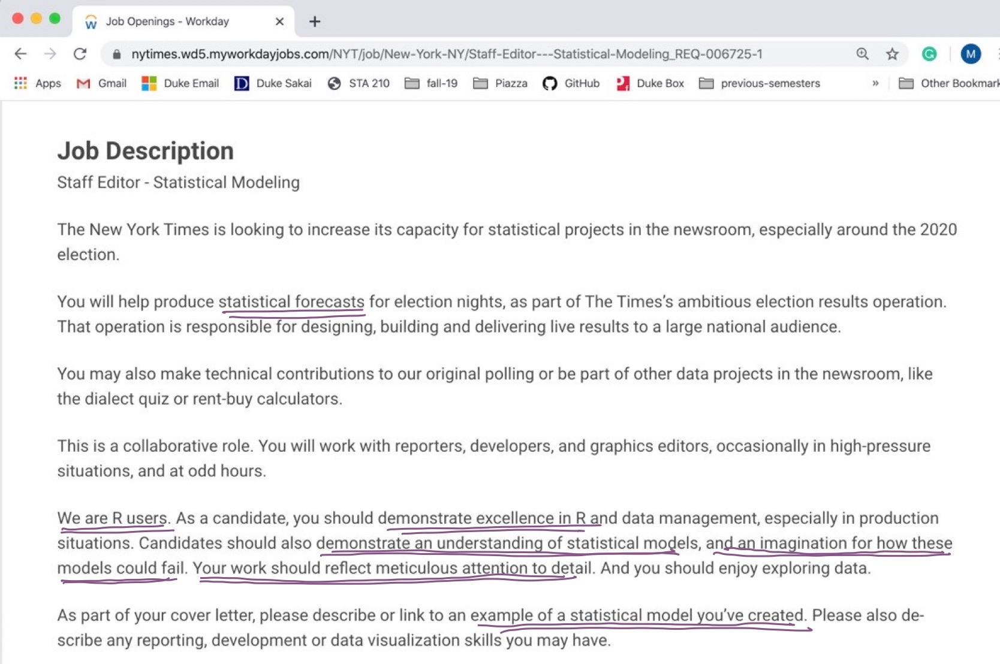
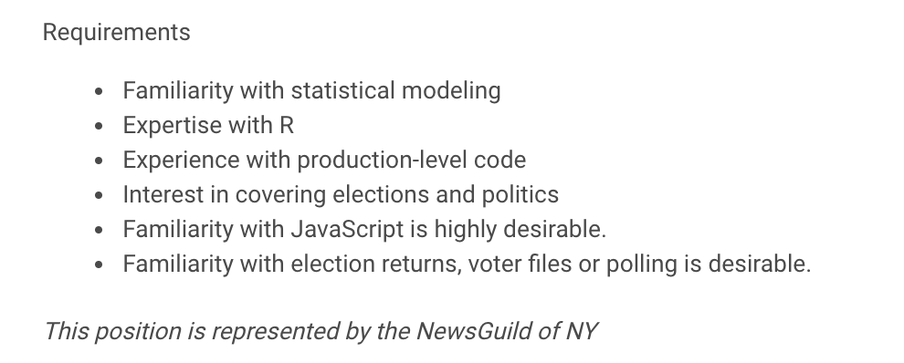

```{r setup, include=FALSE}
# R options
options(
  htmltools.dir.version = FALSE, # for blogdown
  show.signif.stars = FALSE,     # for regression output
  warm = 1
  )
# Set dpi and height for images
library(knitr)
opts_chunk$set(fig.height = 2.65, dpi = 300) 
# ggplot2 color palette with gray
color_palette <- list(gray = "#999999", 
                      salmon = "#E69F00", 
                      lightblue = "#56B4E9", 
                      green = "#009E73", 
                      yellow = "#F0E442", 
                      darkblue = "#0072B2", 
                      red = "#D55E00", 
                      purple = "#CC79A7")

options(htmltools.dir.version = FALSE)
knitr::opts_chunk$set(
	fig.align = "center",
	fig.height = 3.75,
	fig.width = 6.25,
	message = FALSE,
	warning = FALSE
)
```

```{r echo=FALSE, message=FALSE, warning=FALSE}
library(tidyverse)
```

### What is regression analysis?

"In statistical modeling, regression analysis is a set of statistical processes for estimating the relationships among variables. It includes many techniques for modeling and analyzing several variables, when <font class="vocab">**the focus is on the relationship between a dependent variable and one or more independent variables (or 'predictors')**</font>. More specifically, regression analysis helps one understand how the typical value of the dependent variable (or 'criterion variable') changes when any one of the independent variables is varied, while the other independent variables are held fixed."

.pull-right[
- [Wikipedia](https://en.wikipedia.org/wiki/Regression_analysis)
]

---

### Can I get a job that uses regression?

```{r fig.align="center",out.width="90%",echo=FALSE}

```


[NYT Staff Editor - Statistical Modeling](https://nytimes.wd5.myworkdayjobs.com/en-US/News/job/New-York-NY/Staff-Editor---Statistical-Modeling_REQ-006725)

---

```{r fig.align="center",out.width="90%",echo=FALSE}

```

<br><br>
[NYT Staff Editor - Statistical Modeling](https://nytimes.wd5.myworkdayjobs.com/en-US/News/job/New-York-NY/Staff-Editor---Statistical-Modeling_REQ-006725)

---

## Examples of regression anlaysis 

- [New Yorkers Will Pay $56 A Month To Trim A Minute Off Their Commute](https://fivethirtyeight.com/features/new-yorkers-will-pay-56-a-month-to-trim-a-minute-off-their-commute/)

- [How FiveThirtyEight’s 2020 Presidential Forecast Works — And What’s Different Because Of COVID-19](https://fivethirtyeight.com/features/how-fivethirtyeights-2020-presidential-forecast-works-and-whats-different-because-of-covid-19/)

- [Effect of Forensic Evidence on Criminal Justice Case Processing](https://onlinelibrary.wiley.com/doi/10.1111/1556-4029.12020)

- [Why it's so freaking hard to make a good COVID-19 model](https://fivethirtyeight.com/features/why-its-so-freaking-hard-to-make-a-good-covid-19-model/)

---

## Practice with Zoom 

--

- Display your name (not NetID)

--

- Reactions / Raise your hand 

--

- Chat

--


- Poll 

--

- Breakout rooms 

---

### By the end of the semester, you will be able to...

--

- Analyze real-world data to answer questions about multivariable relationships.

--

- Fit and evaluate linear and logistic regression models.

--

- Assess whether a proposed model is appropriate and describe its limitations.

--

- Use R Markdown to write reproducible reports and GitHub for version control and collaboration. 

--

- Communicate results from statistical analyses to a general audience.

---

### Where to find information

.vocab[Course website]: [sta210-sp21.netlify.app](https://sta210-sp21.netlify.app/)
  - Course materials and schedule

--

.vocab[Sakai]
  - Gradebook
  - Link to class meetings on Zoom

--

See the [Tour of course website + Sakai](https://warpwire.duke.edu/w/_wsFAA/) video

--

.vocab[GitHub]: [https://github.com/sta210-sp21](https://github.com/sta210-sp21)
  - Assignment repos (you'll learn more about that in Lab 01)

---

## Activities and assessments

--

- .vocab[Homework]: Individual assignments combining conceptual,  computational,and writing skills. 

--

- .vocab[Labs]: Individual or team assignments focusing on computational skills. 

--

- .vocab[Quizzes]: Periodic quizzes to assess learning

--

- .vocab[Final Project]: Team project presented during the final exam period.

--

- .vocab[Application Exercises]: Exercises completed during the live lecture session.

---

## Where to find help in the course

--

- Attend .vocab[Office hours] to meet with a member of the teaching team.

--

- Use .vocab[Piazza] for general questions about course content and/or assignments, since other students may benefit from the response.

--

- See the [Resources](https://sta210-sp21.netlify.app/resources/) page for computing and statistics resources and academic and wellness support resources

--

- Use email for questions regarding personal matters and/or grades.

---

## Lectures

- Focus on concepts behind data analysis

- Has two components:
  - .vocab[Lecture content video] to watch before we meet
  - .vocab[Live lecture session] to ask questions and apply concepts from videos by working on exercises in small groups. 
  
- Ask questions by "raising your hand" or posting them in the chat. 

- I encourage you to use your video if you are comfortable. 

---

## Course community 

--

- Uphold the Duke Community Standard: 
> - I will not lie, cheat, or steal in my academic endeavors;
>- I will conduct myself honorably in all my endeavors; and
> - I will act if the Standard is compromised.

--

- Respect, honor, and celebrate our diverse community 

--

- Learning environment that is welcoming and accessible to everyone

---

class: middle, center

## [sta210-sp21.netlify.app](https://sta210-sp21.netlify.app)

Look under "Week 01" on the schedule for this week's videos, readings, and assignments.