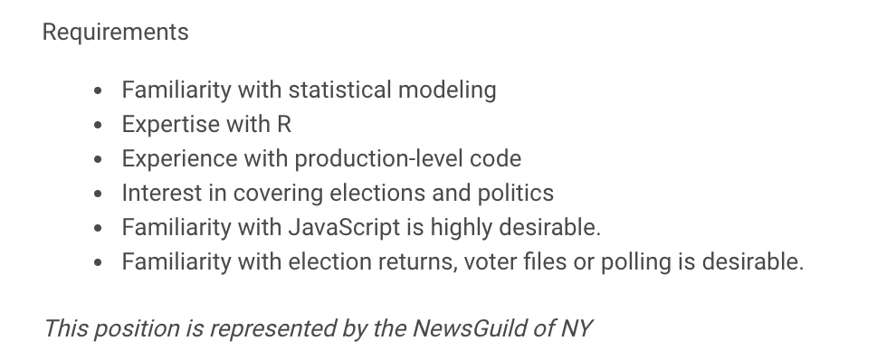

```{r setup, include=FALSE}
# R options
options(
  htmltools.dir.version = FALSE, # for blogdown
  show.signif.stars = FALSE,     # for regression output
  warm = 1
  )
# Set dpi and height for images
library(knitr)
opts_chunk$set(fig.height = 2.65, dpi = 300) 
# ggplot2 color palette with gray
color_palette <- list(gray = "#999999", 
                      salmon = "#E69F00", 
                      lightblue = "#56B4E9", 
                      green = "#009E73", 
                      yellow = "#F0E442", 
                      darkblue = "#0072B2", 
                      red = "#D55E00", 
                      purple = "#CC79A7")

options(htmltools.dir.version = FALSE)
knitr::opts_chunk$set(
	fig.align = "center",
	fig.height = 3.75,
	fig.width = 6.25,
	message = FALSE,
	warning = FALSE
)
```

```{r echo=FALSE, message=FALSE, warning=FALSE}
library(tidyverse)
```

### How are you feeling right now?

<br>

.center[
.col-3[

<font class = "large-emoji">
1) `r emo::ji("slightly_smiling_face")` 
</font>


<br>
<br>

<font class = "large-emoji">
4) `r emo::ji("nerd_face")`
</font>
]

.col-3[

<font class = "large-emoji">
2) `r emo::ji("laughing")`
</font>

<br>
<br>

<font class = "large-emoji">
5) `r emo::ji("slightly_frowning_face")`
</font>

]

.col-3[
<font class = "large-emoji">
3) `r emo::ji("sleeping")`
</font>

<br>
<br>

<font class = "large-emoji">
6) `r emo::ji("sunglasses")`
</font>
]
]

---

### What is regression analysis?

"In statistical modeling, regression analysis is a set of statistical processes for estimating the relationships among variables. It includes many techniques for modeling and analyzing several variables, when <font class="vocab">**the focus is on the relationship between a dependent variable and one or more independent variables (or 'predictors')**</font>. More specifically, regression analysis helps one understand how the typical value of the dependent variable (or 'criterion variable') changes when any one of the independent variables is varied, while the other independent variables are held fixed."

.pull-right[
- [Wikipedia](https://en.wikipedia.org/wiki/Regression_analysis)
]

---

### Can I get a job that uses regression?

```{r fig.align="center",out.width="90%",echo=FALSE}
knitr::include_graphics("img/01/nyt_job.JPG")
```


[NYT Staff Editor - Statistical Modeling](https://nytimes.wd5.myworkdayjobs.com/en-US/News/job/New-York-NY/Staff-Editor---Statistical-Modeling_REQ-006725)

---

```{r fig.align="center",out.width="90%",echo=FALSE}

```

<br><br>
[NYT Staff Editor - Statistical Modeling](https://nytimes.wd5.myworkdayjobs.com/en-US/News/job/New-York-NY/Staff-Editor---Statistical-Modeling_REQ-006725)

---

## Examples of regression anlaysis 

- [New Yorkers Will Pay $56 A Month To Trim A Minute Off Their Commute](https://fivethirtyeight.com/features/new-yorkers-will-pay-56-a-month-to-trim-a-minute-off-their-commute/)

- [How FiveThirtyEight’s 2020 Presidential Forecast Works — And What’s Different Because Of COVID-19](https://fivethirtyeight.com/features/how-fivethirtyeights-2020-presidential-forecast-works-and-whats-different-because-of-covid-19/)

- [Effect of Forensic Evidence on Criminal Justice Case Processing](https://onlinelibrary.wiley.com/doi/10.1111/1556-4029.12020)

- [Why it's so freaking hard to make a good COVID-19 model](https://fivethirtyeight.com/features/why-its-so-freaking-hard-to-make-a-good-covid-19-model/)

---

### Instructor: Prof. Maria Tackett

**Email**: [maria.tackett@duke.edu](mailto:maria.tackett@duke.edu)

--

.pull-left[
```{r, echo=FALSE,out.width = '75%'} 

```

```{r, echo=FALSE,out.width = '75%'} 
knitr::include_graphics("img/01/fbi-fingerprint.jpg")
```

]

--

.pull-right[
```{r, echo=FALSE,out.width = '75%'} 

```
]


---

## Meet your classmates!

(~ 7 minutes)

- Go to a breakout room

- Introduce yourself!
  - Name
  - Year
  - What is something you're looking forward to this semester (either in this class or in general)?

- I'll visit some of the breakout rooms.

- *The breakout rooms are not recorded.*

---

## Practice with Zoom 

--

- Display your name (first and last name)

--

- Raise your hand 

--

- Reactions

--

- Chat

--


- Poll 

--

- Breakout rooms (not recorded)

---

### This semester, you will learn...

- How to apply methods for analyzing multivariate datasets, with an emphasis on interpretation

- How to check whether a proposed statistical model is appropriate for the given data 

- How to address complex research questions using regression analysis

- How to use R and Git to do statistical analysis in a reproducible way 

- The process for conducting data-driven research by applying the methods from this course to a long-term project

---

## Where to find information

**Course Website**: [sta210-fa20.netlify.app/](https://sta210-fa20.netlify.app/)
  - Central hub for the course!

**Sakai**
  - Gradebook
  - Class videos
  - Link to class meetings on Zoom
  
  
**GitHub**:  [https://github.com/sta210-fa20](https://github.com/sta210-fa20)
  - Assignment repos (we'll talk more about that later)

---

## Activities and assessments

--

- .vocab[Homework]: Individual assignments combining conceptual and computational skills. 

--

- .vocab[Labs]: Individual or team assignments focusing on computational skills. 

--

- .vocab[Quizzes]: Four quizzes.

--

- .vocab[Final Project]: Team project presented during the final exam period.

--

- .vocab[Application Exercises]: Exercises worked on during the live lecture session.

--

- .vocab[Statistics Experiences]: Engage with statistics outside of the classroom and reflect on your experience.

---

## Where to find help in the course

--

- Attend .vocab[Office hours] to meet with a member of the teaching team.

--

- Use .vocab[Piazza] for general questions about course content and/or assignments, since other students may benefit from the response.

--

- Use email for questions regarding personal matters and/or grades.

---

## Lectures

- Focus on concepts behind data analysis

- Has two components:
  - **Lecture content videos** to watch before we meet
  - **Live lecture session** to ask questions and apply concepts from videos by working on exercises in small groups. 
  
- Ask questions by "raising your hand" or posting them in the chat. 

- I encourage you to use your video if you are comfortable. 

---

## Course community 

--

- Uphold the Duke Community Standard: 
> - I will not lie, cheat, or steal in my academic endeavors;
>- I will conduct myself honorably in all my endeavors; and
> - I will act if the Standard is compromised.

--

- Respect, honor, and celebrate our diverse community 

--

- Learning environment that is welcoming and accessible to everyone

--


---

class: middle, center

## Your Turn!

---

## Create a GitHub account

.instructions[
Go to https://github.com/, and create an account (unless you already have one). 

After you create your account, go to [https://bit.ly/sta210-github](https://bit.ly/sta210-github) and enter your Duke email address (NETID@duke.edu) and GitHub username. 
]

<small>
Some tips from [Happy Git with R](http://happygitwithr.com/github-acct.html#username-advice).
</small>

- <small>Incorporate your actual name!</small>
- <small> Reuse your username from other contexts if you can, e.<small> g., Twitter or Slack.</small>
- <small> Pick a username you will be comfortable revealing to your future boss.</small>
- <small> Be as unique as possible in as few characters as possible. Shorter is better than longer.</small>
- <small> Make it timeless.</small>
- <small> Avoid words with special meaning in programming (e.g. `NA`).</small>

---

## Let's look at an analysis! 

- Read through the [Movie Data Analysis](https://sta210-fa20.netlify.app/appex/01-movies.html) 

- Talk about the questions under the "Discussion" section in your breakout rooms. 

- We'll choose a few rooms to share their conclusions. 

---

class: middle, center

[sta210-fa20.netlify.app](https://sta210-fa20.netlify.app)

Look under "Week 01" for this week's assignments. 