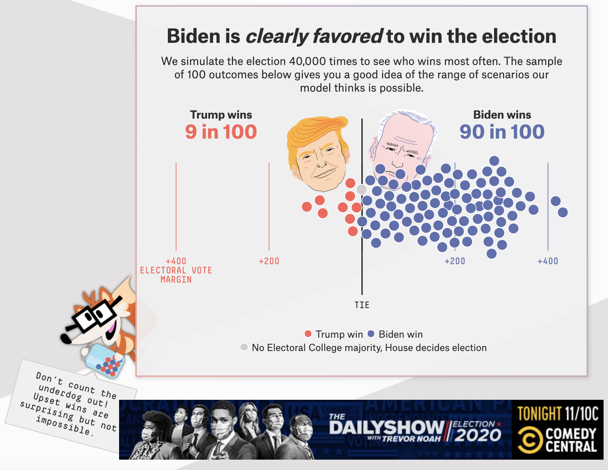
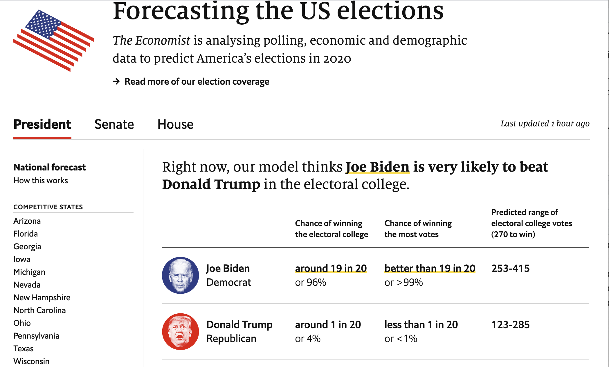

```{r setup, include=FALSE}
# R options
options(
  htmltools.dir.version = FALSE, # for blogdown
  show.signif.stars = FALSE,     # for regression output
  warm = 1
  )
# Set dpi and height for images
knitr::opts_chunk$set(fig.height = 3, fig.width = 5, dpi = 300, 
                      warning = FALSE, 
                      message = FALSE, 
                      fig.align = "center", 
                      cache = TRUE) 
# ggplot2 color palette with gray
color_palette <- list(gray = "#999999", 
                      salmon = "#E69F00", 
                      lightblue = "#56B4E9", 
                      green = "#009E73", 
                      yellow = "#F0E442", 
                      darkblue = "#0072B2", 
                      red = "#D55E00", 
                      purple = "#CC79A7")
htmltools::tagList(rmarkdown::html_dependency_font_awesome())
# For magick
dev.off <- function(){
  invisible(grDevices::dev.off())
}
# For ggplot2
ggplot2::theme_set(ggplot2::theme_bw())
```

```{r packages, echo=FALSE, message=FALSE, warning=FALSE}
library(tidyverse)
library(patchwork)
library(sf)
library(mapview)
xaringanExtra::use_panelset()
```

class: middle, center

### Who are some big names in prediction models?

---

### FiveThirtyEight

```{r fig.align  = "center", out.width = "50%", echo = F}

```

.center[
.small[Screenshot on Nov 2 of [FiveThirtyEight election forecasts](https://projects.fivethirtyeight.com/2020-election-forecast/?cid=rrpromo)].
]

Read more about their methodology [here](https://fivethirtyeight.com/features/how-fivethirtyeights-2020-presidential-forecast-works-and-whats-different-because-of-covid-19/).

---

### The Economist 

```{r fig.align  = "center", out.width = "55%", echo = F}

```

.center[
.small[Screenshot on Nov 2 of [Economist election forecasts](https://projects.economist.com/us-2020-forecast/president)].
]

Read more about their methodology [here](https://projects.economist.com/us-2020-forecast/president/how-this-works). 

---

class: middle, center

### Are the polls taking into account the biases of the polling that caused issues 4 years ago?

---

- There is little evidence of the "shy" Trump voter
  - Study by the [American Association for Public Opinion Research](https://www.aapor.org/Education-Resources/Reports/An-Evaluation-of-2016-Election-Polls-in-the-U-S.aspx) found that "interviewer administered polls did not under-estimate Trump’s support more than self-administered IVR (interactive voice response) and online surveys". 
  
--

- In 2016, many state-level polls underestimated the number of white voters without a four-year college degree.
  - Most polls have started weighting by education to reduce over-weighting of people with a college degree in the sample

--

- In general, some groups of people are hard to reach, so pollsters have to apply statistical methods to re-weight their sample, i.e. make it more representative of the actual electorate (not just representative of who responds to a poll)

---

### Read more about sampling weights 

- [An Evaluation of 2016 Election Polls in the US](https://www.aapor.org/Education-Resources/Reports/An-Evaluation-of-2016-Election-Polls-in-the-U-S.aspx) by the American Association for Public Opinion Research

- [Trump Supporters Aren’t ‘Shy,’ But Polls Could Still Be Missing Some Of Them](https://fivethirtyeight.com/features/trump-supporters-arent-shy-but-polls-could-still-be-missing-some-of-them/) by FiveThirtyEight

- [A Resource for State Preelection Polling](https://www.pewresearch.org/methods/2020/08/18/a-resource-for-state-preelection-polling/) by Pew Research

---

### How statisticians think about predictions

.pull-left[
### Scenario 1

|             | Predicted | Actual  | Error |
|-------------|-----------|---------|-------|
| Candidate A | **51%**       | 49.5%     | -1.5%   |
| **Candidate B** | 49%       | **50.5%** | +1.5%   |

**General consensus**: `r emo::ji("confused")`

**Statistician**: `r emo::ji("smile")`
]

--

.pull-right[
### Scenario 2 

|             | Predicted | Actual  | Error |
|-------------|-----------|---------|-------|
| **Candidate A** | **65%**       | **55%**     | -10%   |
| Candidate B | 35%       | 45% | +10% |

**General consensus**: `r emo::ji("slightly_smiling_face")`

**Statistician**: `r emo::ji("scream")`
]

---

### What to consider when you look at models

Models produce probabilities, not final answers! (Think about your logistic regression models.)
  - In 2016: FiveThirtyEight gave Trump a 30% chance to win the day before the election; the Upshot forecast gave him an 15% chance. 
  - Rare events do happen! **March Madness** `r emo::ji("basketball")`
  - Is 15% or 30% really that rare?

---

## Are models accurate?

But, the models weren't perfect...

--

- In 2016, state polling errors were largely in the same direction 
  - Clinton over-performed in a lot of blue states and under-performed in key Midwest states (**that's a problem! errors should be random**)

--

- Issues with polling get baked into the model (bad data in, bad data out). 

--

- Some models didn't accurately account for correlation between states, especially in the Midwest.

--

- Uncertainty was not effectively communicated to the general public

---

## Read more reflections on 2016 models 

- [An Evaluation of 2016 Election Polls in the US](https://www.aapor.org/Education-Resources/Reports/An-Evaluation-of-2016-Election-Polls-in-the-U-S.aspx) by the American Association for Public Opinion Research

- [The Real Story of 2016](https://fivethirtyeight.com/features/the-real-story-of-2016/) by FiveThirtyEight

- [Presidental Forecast Post- Mortem](https://www.nytimes.com/2016/11/16/upshot/presidential-forecast-postmortem.html#commentsContainer) by the Upshot

---

## Final thoughts 

- Focus on state polls, not national polls! 

--

- Don't read too much into early results
  - Can be potentially misleading based on who is expected to vote early, use mail-in voting, or vote on election day

--

- There is a lot of uncertainty this year! 

--

- Don't let predictions affect your behavior! **VOTE!**


