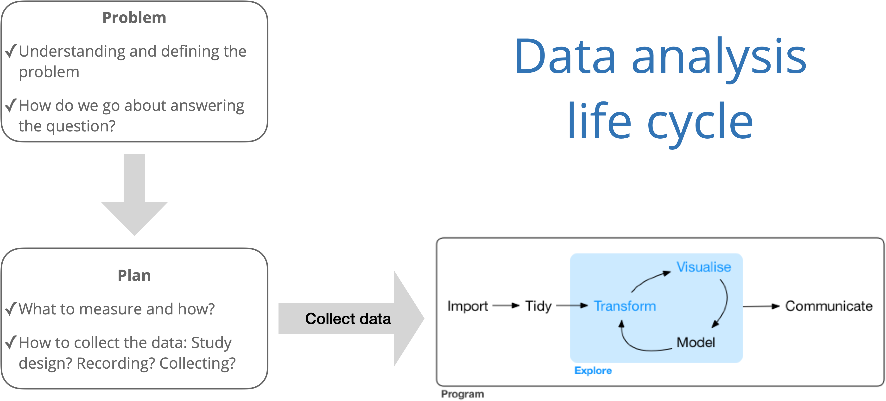

```{r setup, echo = F}
knitr::opts_chunk$set(warning = FALSE, 
                      message = FALSE)
```

```{r load-packages, message=FALSE}
library(tidyverse)
library(broom)
library(patchwork)
```

## Data analysis life cycle

```{r echo = F, fig.cap = "Data science life cycle from [*R for Data Science*](https://r4ds.had.co.nz/) with modifications from *The Art of Statistics: How to Learn from Data*", out.width = "70%", fig.align = "center"}

```


## Clone a repo + start a new project

- Click on the link provided in the slides to create your own private repo for this exercise.

- Go to the `ae-03-[GITHUB USERNAME]` repo on GitHub that you created

- Click on the green **Code** button, **Use HTTPS**, and click on the clipboard icon to copy the repo URL.

- Go to https://vm-manage.oit.duke.edu/containers and login with your Duke NetID and Password. Click to log into the Docker container **RStudio -  statistics application with Rmarkdown and knitr support**. You should now see the RStudio environment. 

- Go to *File* `r emo::ji("arrow_right")` *New Project* `r emo::ji("arrow_right")` *Version Control* `r emo::ji("arrow_right")` *Git*. 

- Copy and paste the URL of your assignment repo into the dialog box *Repository URL*. You can leave *Project Directory Name* empty. It will default to the name of the GitHub repo.

- Click *Create Project*, and the files from your GitHub repo will be displayed the *Files* pane in RStudio. 

### Configure git

Before we start the exercise, we need to configure your git so that RStudio can communicate with GitHub. This requires two pieces of information: your email address and your name.

Type the following lines of code in the **Console** in RStudio filling in your GitHub username and email address associated with your GitHub account.

```{r eval=FALSE}
library(usethis)
use_git_config(user.name= "github username", user.email="your email")
```

**RStudio and GitHub can now communicate with each other and you are ready to do the exercise!**

## Price vs. Mileage


```{r load-data, message=FALSE}
porsche <- read_csv("data/PorschePrice.csv")
```


In this AE, we will analyze the relationship between mileage and price for `r nrow(porsche)` Porsches. The data set includes the following variables: 

- `Price`: Asking price for the car (in $1,000’s)
- `Age`: Age of the car (in years)
- `Mileage`: Previous miles driven (in 1,000’s)

Let's start by getting a quick view of the data. 

```{r glimpse}
glimpse(porsche)
```

Next, let's look at the distributions of the response and predictor variables: 

```{r}
p1 <- ggplot(data = porsche, aes(x = Mileage)) + 
  geom_histogram() + 
  labs(title = "Mileage of Porsches", 
       x = "Mileage (in 1000's)")

p2 <- ggplot(data = porsche, aes(x = Price)) + 
  geom_histogram() + 
  labs(title = "Price of Porsches", 
       x = "Price (in $1,000s)")

p1 + p2 #using the patchwork package
```

```{r}
porsche %>%
  summarise(mean_mileage = mean(Mileage), 
            sd_mileage = sd(Mileage), 
            median_mileage = median(Mileage), 
            IQR_mileage = IQR(Mileage))
```


```{r}
porsche %>%
  summarise(mean_price = mean(Price), 
            sd_price = sd(Price), 
            median_price = median(Price), 
            IQR_price = IQR(Price))
```


```{r summary-stats}
# skim() is from the skimr package
advertising %>% 
  skim()
```

1. What type of advertising typically has the smallest spending?
2. What type of advertising has the largest variation in spending? 
3. Describe the shape of the distribution of `sales`. 

We are most interested in understanding how advertising spending affect sales. One way to quantify the relationship between the variables is by calculating the correlation matrix. 

```{r correlation}
advertising %>% 
  cor()
```

1. What is the correlation between `radio` and `sales`? Interpret this value. 
2. What type of advertising has the strongest linear relationship with `sales`? 

Below are visualizations of `sales` versus each explanatory variable. 

```{r}
ggplot(data = advertising, mapping = aes(x =tv,y = sales)) + 
  geom_point(alpha=0.7) +
  geom_smooth(method="lm",se=FALSE,color="blue") + 
  labs(title = "Sales vs. TV Advertising", 
       x= "TV Advertising (in $thousands)", 
       y="Sales (in $millions") #fill in the Y axis label
```

```{r}
ggplot(data = advertising, mapping = aes(x = radio, y = sales)) + 
  geom_point(alpha = 0.7) + 
  geom_smooth(method = "lm",se=FALSE,color="red") +
  labs(title = "Sales vs. TV Advertising", 
       x= "Radio Advertising (in $thousands)", 
       y="Sales (in $millions)")
```

```{r}
## Fill in the code to create the a scatterplot sales vs. TV ads.
```

Since `tv` appears to have the strongest linear relationship with `sales`, let's calculate a simple linear regression model using these two variables. 

```{r model}
ad_model <- lm(sales ~ tv, data=advertising)
ad_model
```

1. Write the model equation. 
2. Interpret the intercept in the context of the problem. 
3. Interpret the slope in the context of the problem.

*We'll talk about slope and intercept next week!*

## Acknowledgements

The advertising data is from [*Introduction of Statistical Learning*](http://faculty.marshall.usc.edu/gareth-james/ISL/ISLR%20Seventh%20Printing.pdf)