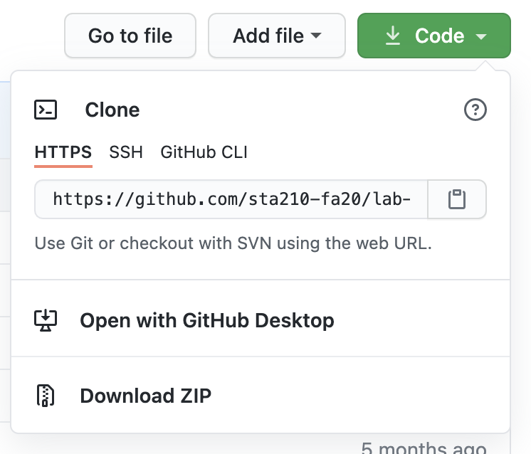
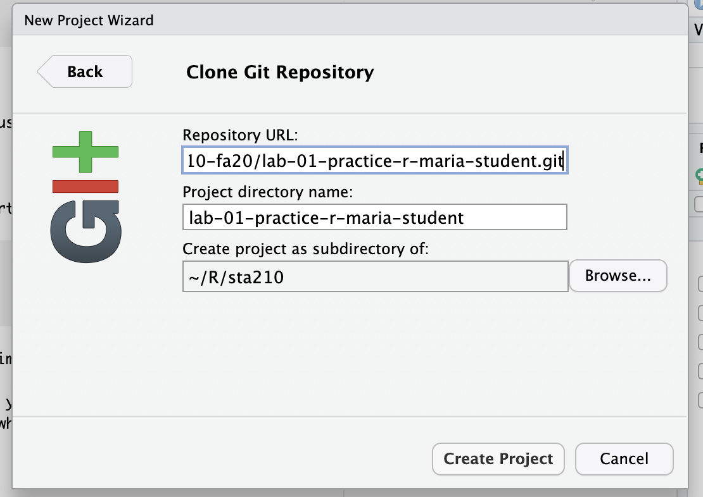
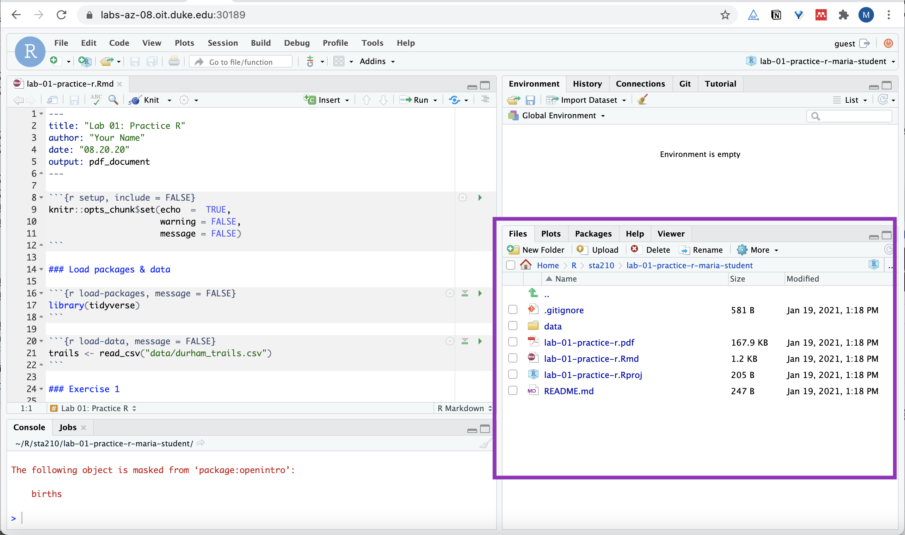

```{r setup, include=FALSE}
knitr::opts_chunk$set(echo = TRUE,
                      warning=FALSE, 
                      message=FALSE)
```


# Introduction

```{marginfigure}
R is the name of the programming language itself and RStudio is a convenient user interface.
```


The goal of this lab is to get you started with the computing workflow we'll use throughout the semester.  You'll get started using writing reproducible reports using R Markdown and practicing version control using git and GitHub.

```{marginfigure}
git is a version control system (like "Track Changes" features from Microsoft Word but more powerful) and GitHub is the home for your Git-based projects on the internet (like DropBox but better).
```

As the labs progress, you are encouraged to explore beyond what the labs dictate; a willingness to experiment will make you a much better programmer and statistician. This lab is a brief review of the fundamental building blocks of R and RStudio: the interface, reading in data, and basic data wrangling and graphing functions. If you're new to R or would like additional practice, there are additional resources listed at the end of the lab instructions. 

Today's lab will be individual, to give you a chance to become more familiar with the workflow. In future labs you will work in teams, and learn how to collaborate using GitHub to produce a single lab report as a team. 

## Learning goals 

- Be familiar with the workflow using RStudio and GitHub
- Be able to write a reproducible report using RMarkdown
- Practice version control using GitHub
- Create data visualizations using ggplot2
- Describe the a distribution and the relationship between multiple variables 

# Getting Started

Each of your assignments will begin with steps in this section. You saw your TA demonstrate these steps, and they're outlined in detail below. Going forward, each lab will begin with a "Getting started" section but the details will become more sparse as the semester progresses. You can always refer back to this lab for a detailed list of the steps involved for getting started with an assignment.

## Clone the repo & start new RStudio project

- Go to the sta210-sp21 organization on GitHub (http://www.github.com/sta210-sp21). Click on the repo with the prefix **lab-01-**. It contains the starter documents you need to complete the lab.

```{r clone-repo-link, fig.margin = TRUE, echo = FALSE, fig.width=3}

```

- Click on the green **Code** button, select **Use HTTPS** (this is the default). Click on the clipboard icon to copy the repo URL.

```{r new-project-from-gh, fig.margin = TRUE, echo = FALSE, fig.width=3, eval = F}
knitr::include_graphics("img/01/new-project-from-gh.png")
```

- Next, open the RStudio Docker container. To do so, 
  - Go to https://vm-manage.oit.duke.edu/containers and login with your Duke NetID and Password.
  - Click to log into the Docker container **STA 210 - Regression Analysis**. You should now see the RStudio environment. 

```{r paste-gh-repo-url, fig.margin = TRUE, echo = FALSE, fig.width=5}

```

- In RStudio, go to *File* `r emo::ji("arrow_right")` *New Project* `r emo::ji("arrow_right")` *Version Control* `r emo::ji("arrow_right")` *Git*. 

- Copy and paste the URL of your assignment repo into the dialog box *Repository URL*. You can leave *Project Directory Name* empty. It will default to the name of the GitHub repo.

- Click *Create Project*, and the files from your GitHub repo will be displayed the *Files* pane in RStudio. 

```{r files-pane, echo = FALSE, fig.width=5}

```


## Configure git 

There is one more thing we need to do before getting started on the assignment. Specifically,  we need to configure your git so that RStudio can communicate with GitHub. This requires two pieces of information: your name and email address.

To do so, you will use the `use_git_config()` function from the `usethis` package. 

Type the following lines of code in the **console** in RStudio filling in your name and the email address associated with your GitHub account.


```{r eval=FALSE}
library(usethis)
use_git_config(user.name = "GitHub username", 
               user.email="your email")
```

For example, mine would be 

```{r eval=FALSE}
library(usethis)
use_git_config(user.name="matackett",
               user.email="maria.tackett@duke.edu")
```

<!--
If you get the error message

```{r eval=FALSE}
Error in library(usethis) : there is no package called ‘usethis’
```

then you need to install the `usethis` package. Run the following code in the console to install the package. Then, rerun the `use_git_config` function with your GitHub username and email address associated with your GitHub account.

```{r eval=FALSE}
install.package("usethis")
```
-->

Now you're ready to start! Open the R Markdown file, i.e. the one with the .Rmd extension. 

## RStudio & R Markdown

<br>

Below are the general components of an RStudio project. 

```{r echo=FALSE, fig.fullwidth = TRUE}
knitr::include_graphics("img/01/rstudio-panes.png")
```


Below are the general components of an RMarkdown file. 

```{r echo=FALSE, fig.fullwidth = TRUE}
knitr::include_graphics("img/01/rmarkdown.jpg")
```

To get more details about the RStudio project, RMarkdown file, and just R in general, read [Getting Started](https://socviz.co/gettingstarted.html#gettingstarted) in *Data Visualization* by Kieran Healy.


## Packages

We will use the following package in today's lab. 

```{r load-packages}
library(tidyverse)
```


## YAML 

```{marginfigure}
The top portion of your R Markdown file (between the three dashed lines) is called YAML. It stands for "YAML Ain't Markup Language". It is a human friendly data serialization standard for all programming languages. All you need to know is that this area is called the YAML (we will refer to it as such) and that it contains meta information about your document.
```

Before we introduce the data, let's update the name and date in the YAML. 

Open the R Markdown (Rmd) file in your project, input your name for the author name and today's date for the date, and knit the document.

## Committing changes:

Next, go to the *Git* pane in RStudio. 

If you have made changes to your Rmd file, you should see it listed here. Click on it to select it in this list and then click on **Diff**. This shows you the difference between the last committed state of the document and its current state with your changes. If you're happy with these changes, write "Update author name" in the **Commit message** box and click **Commit**.

You don't have to commit after every change, this would get quite cumbersome. You should consider committing states that are *meaningful to you* for inspection, comparison, or restoration. In the first few assignments, we will provide some guidance on when to commit and an example commit message.

## Pushing changes: 

Now that you have made an update and committed this change, it's time to push these changes to the web! Or more specifically, to your repo on GitHub. Why? So that others can see your changes. And by others, we mean the course teaching team. (Your repos in this course are private and can only be seen by you and the teaching team.)

In order to push your changes to GitHub, click **Push**. This will prompt a dialogue box where you first need to enter your user name, and then your password. This might feel cumbersome. Bear with me... We *will* teach you how to save your password so you don't have to enter it every time. But for this one assignment you'll have to manually enter each time you push in order to gain some experience with it.

The *Git* pane should be empty after you push. If it's not, click the box next to the remaining files, write an informative commit message, and push.

Now let's make sure all the changes went to GitHub. Go to your GitHub repo and refresh the page. You should see your commit message next to the updated files. If you see this, all your changes are on GitHub and you're good to go! 


# Data: Ikea furniture

Today's data is all [Ikea](https://www.ikea.com/) furniture. The data was obtained from the [TidyTuesday](https://github.com/rfordatascience/tidytuesday/blob/master/data/2020/2020-11-03/readme.md) data collection. 

Use the code below to read in the data.

```{r read-data}
ikea <- read_csv("data/ikea.csv")
```

The variable definitions are as follows: 

|variable          |class     |description |
|:-----------------|:---------|:-----------|
|item_id           |double    | item id which can be used later to merge with other IKEA data frames |
|name              |character | the commercial name of items |
|category          |character | the furniture category that the item belongs to (Sofas, beds, chairs, Trolleys,…) |
|sellable_online   |logical   | Sellable online TRUE or FALSE |
|link              |character | the web link of the item |
|other_colors      |character | if other colors are available for the item, or just one color as displayed in the website (Boolean) |
|short_description |character | a brief description of the item |
|designer          |character | The name of the designer who designed the item. this is extracted from the full_description column. |
|depth             |double    | Depth of the item in Centimeter |
|height            |double    | Height of the item in Centimeter|
|width             |double    | Width of the item in Centimeter|
|price_usd            |double    | the current price in US dollars as it is shown in the website by 4/20/2020|

## View the data 

Before doing any analysis, you may want to get quick view of the data. This is a useful when you've imported data to see if your data imported correctly. We can use the `View` function to see the entire data set in RStudio. Type the code below in the **console** to view the entire dataset. 

```{marginfigure}
Notice that the `View(ikea)` command was run in the console and **not** in a code chunk in the RMarkdown file. By running the `View(ikea)` in the console, the dataset displays in your RStudio environment but not in the PDF output from your knitted Rmd file. 
```

```{r eval=FALSE}
View(ikea)
```

# Exercises 

## Instructions 

Write all code and narrative in your R Markdown file. Write all narrative in complete sentences. Periodically throughout the assignment, you should **knit** your R Markdown document to produce the updated PDF, **commit** the changes in the Git pane, and **push** the updated files to GitHub. 

**Tip** Make sure we can read all or your code in your PDF document. This means you will need to break up long lines of code. One way to help avoid long lines of code is is start a new line after every pipe (`%>%`) and plus sign (`+`). 

1. The `View` function helped us get a quick view of the dataset, but let's get more detail about its structure. Often viewing a summary of the data is more useful than viewing the raw data, especially if the dataset has a large number of observations (rows) or variables (columns). Run the code below to use the `glimpse` function to see a summary of the `ikea` dataset.

  How many observations are in the `ikea` dataset? How many variables?


```{r eval = F}
glimpse(ikea)
```

2. We begin each regression analysis with with exploratory data analysis (EDA) to help us "get to know" the data and examine the variable distributions and relationships between variables. We do this by visualizing the data and calculating summary statistics to describe the variables in our dataset. In this lab, we will focus on data visualizations. 


  Let's begin by looking at the price of Ikea furniture. Use the code below to visualize the distribution of `price_usd`, the price in US dollars. 

```{r}
ggplot(data = ikea, aes(x = price_usd)) +
  geom_histogram()
```

Use the visualization to describe the distribution of price. In your narrative, include description of the shape, approximate center, approximate spread, and any presence of outliers. 

3. When we make visualizations, we want to make sure they are clear and suitable for a professional audience. This means that, at a minimum, each visualization should have **an informative title** and **informative axis labels**. Let's modify the plot from the previous question to make it suitable for a professional audience. Modify the code below to include an informative title and axis labels. 

```{r eval = F}
ggplot(data = ikea, aes(x = price_usd)) +
  geom_histogram() + 
  labs(x = "_____",
       y = "_____", 
       title = "_____")
```


4. Another way to visualize numeric data is using density plots. Make a density plot to visualize the distribution of `price_usd`. Be sure to include an informative title and informative axis labels. 


```{marginfigure}
See the [ggplot2 reference on density plots](https://ggplot2.tidyverse.org/reference/geom_density.html) for code examples.
```

<div class = "commit">
This is a good place to knit, commit, and push changes to your remote lab-01 repo on GitHub. Be sure to write an informative commit message (e.g. "Completed exercises 1 - 4"), and push every file to GitHub by clicking the checkbox next to each file in the Git pane. After you push the changes, the Git pane in RStudio should be empty."
</div>

```{marginfigure}
Check your lab-01 repo on the GitHub website (you may need to refresh the page in your browser) to ensure that all of the files are up-to-date.
```


  We are most interested in the relationship between two or more variables, so let's begin by looking at the distribution of price by category. We'll focus on the five categories in the code below, since these include commonly purchased types of furniture. 

Use the code below to name the new data frame that only includes the furniture categories of interest. We're giving this subset a new name, so we don't overwrite the original data. 

**You will use this new data frame for the remainder of the lab.**

```{r}
ikea_sub <- ikea %>%
  filter(category %in% c("Tables & desks", "Bed", 
                         "Bookcases & shelving units", 
                         "Sofas & armchairs", "Children's furniture"))
```

5. Let's make a density plot with the density curves colored by category, so we can compare the distribution of price for each category. 

```{r}
ggplot(data = ikea_sub, aes(x = price_usd, fill = category)) +
  geom_density() 
```

  The overlapping colors make it difficult to tell what’s happening with the distributions for the categories plotted first and hence covered by continents plotted over them. We can change the transparency level of the fill color to help with this. The alpha argument takes values between 0 and 1: 0 is completely transparent and 1 is completely opaque. There is no way to tell what value will work best, so it’s best to try a few.

```{r}
ggplot(data = ikea_sub, aes(x = price_usd, fill = category)) +
  geom_density(alpha = 0.8) 
```

Recreate the density plot using a more suitable alpha level, so we can more easily see the distribution of all the categories. Include an informative title and axis labels.

6. Briefly describe why we defined the fill of the curves by mapping aesthetics of the plot but we defined the alpha level as a characteristic of the plotting geom.

7. Overlapping density plots are not the only way to visualize the relationship between a quantitative and categorical variable. Use a different type of plot to visualize the relationship between price and category. 

You can use the [ggplot2 cheatsheet](https://rstudio.com/wp-content/uploads/2015/03/ggplot2-cheatsheet.pdf) and [from Data to Viz](https://www.data-to-viz.com/#ridgeline) for inspiration. 

8. Compare and contrast your plots from the previous exercise and the overlapping density plots. What features are apparent in the plot from the previous exercise that aren't in the overlapping density plots. What features are apparent in the overlapping density plots that aren't in the plot from the previous exercise? What features are apparent in both? 

<div class = "commit">
This is another good place to knit, commit, and push changes to your remote lab-01 repo on GitHub. Be sure to write an informative commit message (e.g. "Completed exercises 5 - 8"), and push every file to GitHub by clicking the checkbox next to each file in the Git pane. After you push the changes, the Git pane in RStudio should be empty."
</div>


9. Next, let's look at the relationship between the price and width of Ikea furniture. Fill in the code below  to visualize the relationship between the two variables using a scatterplot.

```{r eval = F}
ggplot(data = _____, aes(x = width, y = _____)) +
  geom_point() + 
  labs(x = "_____", 
       y = "_____", 
       title = "_____")
````

Use your visualization to describe the relationship between the width and price of Ikea furniture. 

10. Color the points of the scatterplot by category. Does there seem to be any clear distinctions between categories with respect to the relationship between the price and width of Ikea furniture? Briefly explain.


<div class = "commit">
You're done and ready to submit your work! Knit, commit, and push all remaining changes. You can use the commit message "Done with Lab 1!", and make sure you have pushed all the files to GitHub (your Git pane in RStudio should be empty) and that<u>all</u> documents are updated in your repo on GitHub. The PDF document you submit to Gradescope should be identical to the one in your GitHub repo. 

See the instructions to submit your work on Gradescope.
</div>

# Submission

In this class, we'll be submitting .pdf documents to Gradescope. Once you are fully satisfied with your lab, **Knit to .pdf** to create a .pdf document. You may notice that the formatting/theme of the report has changed -- this is expected.

**Before you wrap up the assignment, make sure all documents are updated on your GitHub repo. we will be checking these to make sure you have been practicing how to commit and push changes.**

**Remember -- you must turn in a .pdf file to the Gradescope page before the submission deadline for full credit.** 

Once your work is finalized in your GitHub repo, you will submit it to Gradescope. **Your assignment must be submitted on Gradescope by the deadline to be considered "on time".**

To submit your assignment: 

- Go to http://www.gradescope.com and click *Log in* in the top right corner. 

- Click *School Credentials* `r emo::ji("arrow_right")` *Duke NetID* and log in using your NetID credentials.

- Click on your *STA 210* course. 

- Click on the assignment, and you'll be prompted to submit it.

- Mark the pages associated with each exercise. All of the papers of your lab should be associated with at least one question (i.e., should be "checked"). 

- Select the first page of your .pdf submission to be associated with the *"Overall"* section.

# Resources for additional practice (optional)

- [Chapter 2: Get Started](https://socviz.co/gettingstarted.html#work-in-plain-text-using-rmarkdown) *Data Visualization by Kieran Healy* 

- [Chapter 3: Data visualization](https://r4ds.had.co.nz/data-visualisation.html) in *R for Data Science* by Hadley Wickham

- RStudio Cloud Primers
  - Visualization Basics: https://rstudio.cloud/learn/primers/1.1
  - Work with Data: https://rstudio.cloud/learn/primers/2
  - Visualize Data: https://rstudio.cloud/learn/primers/3

<br><br>
<hr>

<div class = "footer">
This lab was adapted from [Data Science in a Box](https://rstudio-education.github.io/datascience-box/course-materials/lab-instructions/lab-02/lab-02-plastic-waste.html).
</div>
