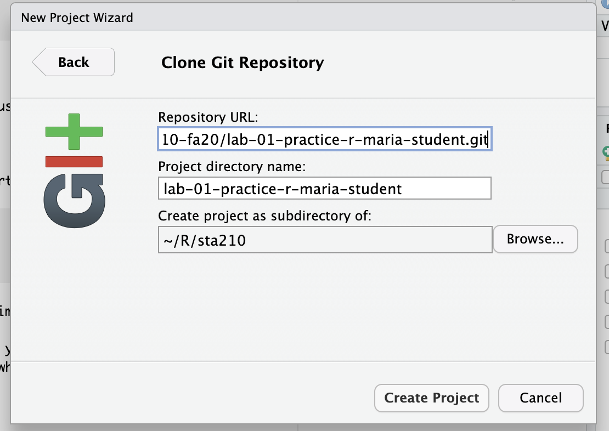
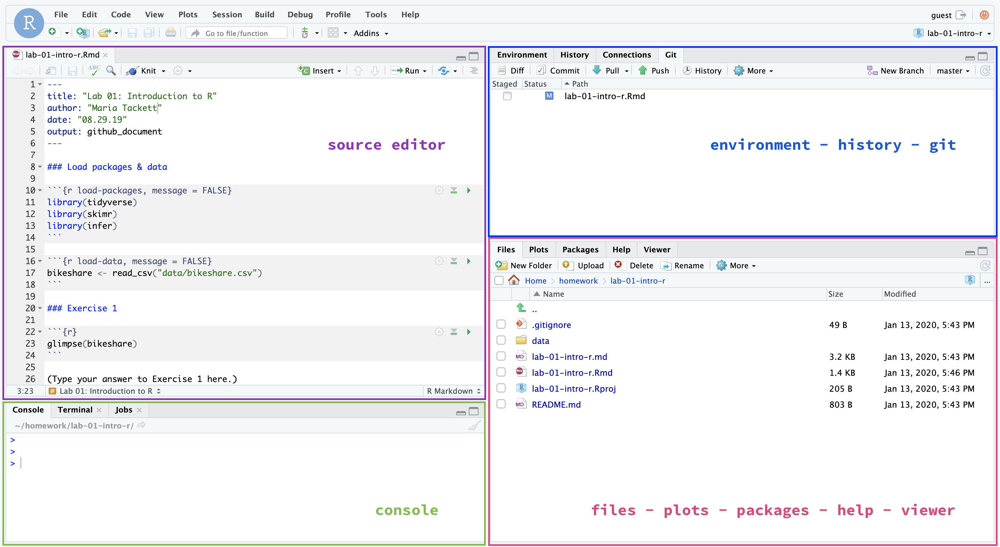

```{r setup, include=FALSE}
knitr::opts_chunk$set(echo = TRUE,
                      warning=FALSE, 
                      message=FALSE)
```


# Introduction

```{marginfigure}
R is the name of the programming language itself and RStudio is a convenient user interface.
```

The main goal of this lab is to review the basics of R and RStudio. We will use these tools throughout this course to analyze and make conclusions from real-world data. 

```{marginfigure}
git is a version control system (like "Track Changes" features from Microsoft Word but more powerful) and GitHub is the home for your Git-based projects on the internet (like DropBox but better).
```

An additional goal is to introduce you to git and GitHub, which is the version control and collaboration system we will use throughout the course.

As the labs progress, you are encouraged to explore beyond what the labs dictate; a willingness to experiment will make you a much better programmer and statistician. This lab is a brief review of the fundamental building blocks of R and RStudio: the interface, reading in data, and basic data wrangling and graphing functions. If you're new to R or would like additional practice, there are resources listed at the end of the lab instructions. 

Today's lab will focus on fundamental building blocks of R and RStudio: the interface, reading in data, and basic commands. Starting next week, the labs will focus on concepts more specific to regression analysis. Today's lab will be individual, to give you a chance to become more familiar with the workflow. In future labs you will work in teams, and learn how to collaborate using GitHub to produce a single lab report as a team. 

## Topics covered in this lab:

- Exploratory Data Analysis (EDA) - data visualizations and numerical summaries
- Statistical inference about a mean
- Writing a lab report using R Markdown
- Tracking changes and using git and GitHub

# Getting Started

Each of your assignments will begin with steps in this section. You saw your TA demonstrate these steps, and they're outlined in detail below. Going forward, each lab will begin with a "Getting started" section but the details will become more sparse as the semester progresses. You can always refer back to this lab for a detailed list of the steps involved for getting started with an assignment.

## Clone the repo & start new RStudio project

- Go to the sta210-fa20 organization on GitHub (http://www.github.com/sta210-fa20). Click on the repo with the prefix **lab-01-review-r-**. It contains the starter documents you need to complete the lab.

```{r clone-repo-link, fig.margin = TRUE, echo = FALSE, fig.width=3}
knitr::include_graphics("img/01/clone-repo-link.png")
```

- Click on the green **Clone or download** button, select **Use HTTPS** (this might already be selected by default, and if it is, you'll see the text **Clone with HTTPS** as in the image below). Click on the clipboard icon to copy the repo URL.

```{r new-project-from-gh, fig.margin = TRUE, echo = FALSE, fig.width=3, eval = F}
knitr::include_graphics("img/01/new-project-from-gh.png")
```

- Go to https://vm-manage.oit.duke.edu/containers and login with your Duke NetId and Password.

- Click to log into the Docker container **STA 210 - Regression Analysis**. You should now see the RStudio environment. 

```{r paste-gh-repo-url, fig.margin = TRUE, echo = FALSE, fig.width=5}

```

- Go to *File* `r emo::ji("arrow_right")` *New Project* `r emo::ji("arrow_right")` *Version Control* `r emo::ji("arrow_right")` *Git*. 

- Copy and paste the URL of your assignment repo into the dialog box *Repository URL*. You can leave *Project Directory Name* empty. It will default to the name of the GitHub repo.


- Click *Create Project*, and the files from your GitHub repo will be displayed the *Files* pane in RStudio. 

## Configure git 

There is one more piece of housekeeping we need to take care of before we get started. Specifically,  we need to configure your git so that RStudio can communicate with GitHub. This requires two pieces of information: your name and email address.

To do so, you will use the `use_git_config()` function from the `usethis` package. 

Type the following lines of code in the **console** in RStudio filling in your name and email address.

```{marginfigure}
The email address is the one tied to your GitHub account. 
```

```{r eval=FALSE}
library(usethis)
use_git_config(user.name = "GitHub username", 
               user.email="your email")
```

For example, mine would be 

```{r eval=FALSE}
library(usethis)
use_git_config(user.name="matackett",
               user.email="maria.tackett@duke.edu")
```

<!--
If you get the error message

```{r eval=FALSE}
Error in library(usethis) : there is no package called ‘usethis’
```

then you need to install the `usethis` package. Run the following code in the console to install the package. Then, rerun the `use_git_config` function with your GitHub username and email address associated with your GitHub account.

```{r eval=FALSE}
install.package("usethis")
```
-->

Now you're ready to start! Open the R Markdown file, i.e. the one with the .Rmd extension. 

## RStudio & R Markdown

<br>

Below are the general components of an RStudio project. 

```{r echo=FALSE, fig.fullwidth = TRUE}

```


Below are the general components of an RMarkdown file. 

```{r echo=FALSE, fig.fullwidth = TRUE}
knitr::include_graphics("img/01/rmarkdown.jpg")
```

To get more details about the RStudio project, RMarkdown file, and just R in general, read [Getting Started](https://socviz.co/gettingstarted.html#gettingstarted) in *Data Visualization* by Kieran Healy.


## Packages

We will use the following package in today's lab. 

```{r load-packages}
library(tidyverse)
```

If you need to install the package, run the code below in the **console**.

```{r,eval=F}
install.packages("tidyverse") 
```

## YAML 

```{marginfigure}
The top portion of your R Markdown file (between the three dashed lines) is called YAML. It stands for "YAML Ain't Markup Language". It is a human friendly data serialization standard for all programming languages. All you need to know is that this area is called the YAML (we will refer to it as such) and that it contains meta information about your document.
```

Before we introduce the data, let's update the name and date in the YAML. 


Open the R Markdown (Rmd) file in your project, input your name for the author name and today's date for the date, and knit the document.

## Committing changes:

Next, go to the *Git* pane in RStudio. 

If you have made changes to your Rmd file, you should see it listed here. Click on it to select it in this list and then click on **Diff**. This shows you the difference between the last committed state of the document and its current state with your changes. If you're happy with these changes, write "Update author name" in the **Commit message** box and click **Commit**.

You don't have to commit after every change, this would get quite cumbersome. You should consider committing states that are *meaningful to you* for inspection, comparison, or restoration. In the first few assignments, we will provide some guidance on when to commit and an example commit message.

## Pushing changes: 

Now that you have made an update and committed this change, it's time to push these changes to the web! Or more specifically, to your repo on GitHub. Why? So that others can see your changes. And by others, we mean the course teaching team. (Your repos in this course are private and can only be seen by you and the teaching team.)

In order to push your changes to GitHub, click **Push**. This will prompt a dialogue box where you first need to enter your user name, and then your password. This might feel cumbersome. Bear with me... We *will* teach you how to save your password so you don't have to enter it every time. But for this one assignment you'll have to manually enter each time you push in order to gain some experience with it.

Make sure you push all the files from the *Git* pane to your assignment repo on GitHub. The Git pane should be empty after you push. If it's not, click the box next to the remaining files, write an informative commit message, and push.

# Data: Trails in Durham, NC

Today's data comes from the [Durham Open Data](https://live-durhamnc.opendata.arcgis.com/) a program managed by the City of Durham's Technology Solutions Department and the County of Durham's Information Services & Technology Department to provide open data about our community. You can read more about their mission [here](https://live-durhamnc.opendata.arcgis.com/pages/about-us).

In this lab, we will focus on data about the proposed and existing outdoor trails in Durham, NC. The data is located in the *durham_trails.csv* file located in the *data* folder. Use the code below to read in the .csv file and save it in the RStudio environment as a data frame called `trails`.

```{r read-data, eval=FALSE}
trails <- read_csv("data/durham_trails.csv")
```

A full list of the variables in the dataset is available  [here](https://live-durhamnc.opendata.arcgis.com/datasets/existing-and-proposed-trails?geometry=-80.283%2C35.650%2C-77.473%2C36.428). For today's analysis, we will primarily focus on the following variables: 

|  |  |
|----------|-------|
| `status` |Whether the trail is proposed or existing|
| `dogwalking` | Whether dogs are allowed on the trail |
| `length` | Length of the trail in miles |
| `trailtype` | Description of trail (crosswalk, sidewalk, walking path, etc.) |


# Exercises 

**Write your answers in complete sentences and show all code and output.**

Before doing any analysis, we may want to get quick view of the data. This is a useful thing to do after importing data to see if the data imported correctly. One way to do this, is to look at the actual dataset. Type the code below in the **console** to view the entire dataset. 

```{marginfigure}
Notice that the `View(trails)` command was run in the console and **not** in a code chunk in the RMarkdown file. By running the `View(trails)` in the console, the dataset displays in your RStudio environment but not in the output from your RMarkdown file.
```

```{r eval=FALSE}
View(trails)
```


## Exploratory Data Analysis

1. Now that we've had a quick view of the dataset, let's get more details about its structure. Sometimes viewing a summary of the data structure is more useful than viewing the raw data, especially if the dataset has a large number of observations and/or rows. Run the code below to use the `glimpse` function to see a summary of the `trails` dataset.

    How many observations are in the `trails` dataset? How many variables?

  
```{r eval = F}
glimpse(trails)
```


2. We start each analysis exploratory data analysis (EDA). Much of EDA consists of visualizing the data but it also includes calculating summary statistics for the variables in our dataset. Let's begin by examining the distribution of `trailtype` with a data visualization and summary statistics. 

    - What is a type of graph that's appropriate to visualize the distribution of `trailtype`? Fill in the `ggplot` code below to plot the distribution of `trailtype`. Include informative axis labels and title on the graph.
    
    - Complete the code to calculate the proportion of observations in each category of `trailtype`. 
    
    - Use the graphs and summary statistics to describe the distribution of `trailtype`. 

```{r eval=FALSE}
ggplot(data = trails, aes(x = trailtype)) + 
  __________ + 
  labs(x = "_________", 
       y = "_________", 
       title = "__________") +
  coord_flip() #help make axes readable
```


```{r eval = FALSE}
trails %>%
  count(_____) %>%
  mutate(proportion = n / sum(n))
```

3. Since we want to analyze characteristics for outdoor trails in Durham, we will just use data from trails that existed as of January 2020 for the remainder of the analysis. Complete the code below to use the `filter` function to create a subset consisting only of trails that existed when this data set was created and have a value reported for `length`. **You will use this subset for the rest of the lab.**

```{r eval = F}
__________ <- trails %>%
  filter(status == "______", !is.na(______))
````


```{marginfigure}
Check your lab-01 repo on the GitHub website (you may need to refresh the page in your browser) to ensure that all of the files are up-to-date.
```

<div class = "commit">
This is a good place to knit, commit, and push changes to your remote lab-01 repo on GitHub. Be sure to write an informative commit message (e.g. "Completed exercises 1 - 3"), and push every file to GitHub by clicking the checkbox next to each file in the Git pane. After you push the changes, the Git pane in RStudio should be empty."
</div>

4. Let's examine the distribution of `length`. One important part of EDA is creating data visualizations to see the shape, center, spread, and outliers in a distribution. Data visualizations are also useful for examining the relationship between multiple variables. There are a lot of ways to make data visualizations in R; we will use the functions available in the `ggplot2` package.

   Make a graph to visualize the distribution of `length`. Include an informative title and axis labels.

```{marginfigure}
See [Section 7.3.1 "Visualizing Distributions"](https://r4ds.had.co.nz/exploratory-data-analysis.html#introduction-3) or the [ggplot2 reference page](https://ggplot2.tidyverse.org/reference/index.html) for details and example code.
```                                               

5. Next, fill in the code below to use the `summarise` function to calculate various summary statistics for the variable `length`. You can use the [summarise reference page](https://dplyr.tidyverse.org/reference/summarise.html) for more information about the function and example code. 

```{r eval = FALSE}
current_trails %>%
  summarise(min = __________, 
            q1 = __________, 
            median = __________, 
            q3 = __________, 
            max = __________, 
            iqr = __________, 
            mean = __________, 
            std_dev = __________
            )
```

6. Briefly describe the distribution of `length`. Your description should include comments about the shape, center, spread, and any potential outliers. Use the graph from Exercise 4 and relevant summary statistics from Exercise 5 in your description.

7. We want to limit the analysis to trails that are more likely intended for day hikes, rather than multi-day hikes and camping. Therefore, let's remove the extreme outliers from the data for this analysis and only consider those trails that are 15 miles or shorter. 

    Filter the dataset to remove the extreme outliers. **Be sure to save the updated dataset, so you can use it for the remainder of the lab.** 
    
<div class = "commit">
This is a good place to knit, commit, and push changes to your remote lab-01 repo on GitHub. Be sure to write informative commit message (e.g. "Completed exercises 4 - 7"), and push every file to GitHub by clicking the checkbox next to each file in the Git pane. After you push the changes, the Git pane in RStudio should be empty.
</div>

8. Consider the distribution of `dogwalking`. 
    - What are the values of `dogwalking` in the dataset? Show the code and output to support your answer. 
    - What do you think is the most likely reason for the missing observations of `dogwalking`? In other words, what does a missing value of `dogwalking` indicate? 

9. Complete the code below to impute (i.e. fill in) the missing values of `dogwalking` with the appropriate value.  Then, display the distribution of `dogwalking` to check that the missing values were correctly imputed.

```{r eval=FALSE}
__________ <- __________ %>%
  mutate(dogwalking = if_else(is.na(dogwalking),______,dogwalking))
```

10. Now that we've completed the univariate EDA (i.e. examining one variable at a time), let's examine the relationship between the length of the trail and whether dog walking is allowed. Make a graph to visualize the relationship between `length` and `dogwalking` and calculate the appropriate summary statistics. Include informative axis labels and title on your graph.

11. Describe the relationship between `length` and `dogwalking`. In other words, describe how the distribution of `length` compares between trails that allow dog walking versus those that don't. Include information from the graph and summary statistics from the previous exercise in your response.

<div class = "commit"> 
This is a good place to knit, commit, and push changes to your remote lab-01 repo on GitHub. Be sure to write informative commit message (e.g. "Completed exercises 8 - 11"), and push every file to GitHub by clicking the checkbox next to each file in the Git pane. After you push the changes, the Git pane in RStudio should be empty.
</div>


12. On page 2 of [Elements and Principles for Characterizing Variation
between Data Analyses](https://arxiv.org/pdf/1903.07639.pdf), the authors identify 8 elements that are used to build a data analysis. For each of the 8 elements, type "Yes" if it was used in this lab (i.e. your data analysis) or "No" if it wasn't. 

**You're done and ready to submit your work! Knit, commit, and push all remaining changes. You can use the commit message "Done with Lab 1!", and make sure you have pushed all the files to GitHub (your Git pane in RStudio should be empty) and that<u>all</u> documents are updated in your repo on GitHub. Then submit the assignment on Gradescope following the instructions below.**

# Submission

In this class, we'll be submitting .pdf documents to Gradescope. Once you are fully satisfied with your lab, **Knit to .pdf** to create a .pdf document. You may notice that the formatting/theme of the report has changed -- this is expected.

**Before you wrap up the assignment, make sure all documents are updated on your GitHub repo. we will be checking these to make sure you have been practicing how to commit and push changes.**

**Remember -- you must turn in a .pdf file to the Gradescope page before the submission deadline for full credit.** 

Once your work is finalized in your GitHub repo, you will submit it to Gradescope. **Your assignment must be submitted on Gradescope by the deadline to be considered "on time".**

To submit your assignment: 

- Go to http://www.gradescope.com and click *Log in* in the top right corner. 

- Click *School Credentials* `r emo::ji("arrow_right")` *Duke NetID* and log in using your NetID credentials.

- Click on your *STA 210* course. 

- Click on the assignment, and you'll be prompted to submit it.

- Mark the pages associated with each exercise, 1 - 12. All of the papers of your lab should be associated with at least one question (i.e., should be "checked"). 

- Select the first page of your .pdf submission to be associated with the *"Overall"* section.

# Resources for additional practice (optional)

- [Chapter 2: Get Started](https://socviz.co/gettingstarted.html#work-in-plain-text-using-rmarkdown) *Data Visualization by Kieran Healy* 

- [Chapter 3: Data visualization](https://r4ds.had.co.nz/data-visualisation.html) in *R for Data Science* by Hadley Wickham

- RStudio Cloud Primers
  - Visualization Basics: https://rstudio.cloud/learn/primers/1.1
  - Work with Data: https://rstudio.cloud/learn/primers/2
  - Visualize Data: https://rstudio.cloud/learn/primers/3

<br><br>
<hr>

<div class = "footer">
This work is licensed under the [Creative Commons Attribution-NonCommercial-ShareAlike 4.0 International License](https://creativecommons.org/licenses/by-nc-sa/4.0/).
</div>
