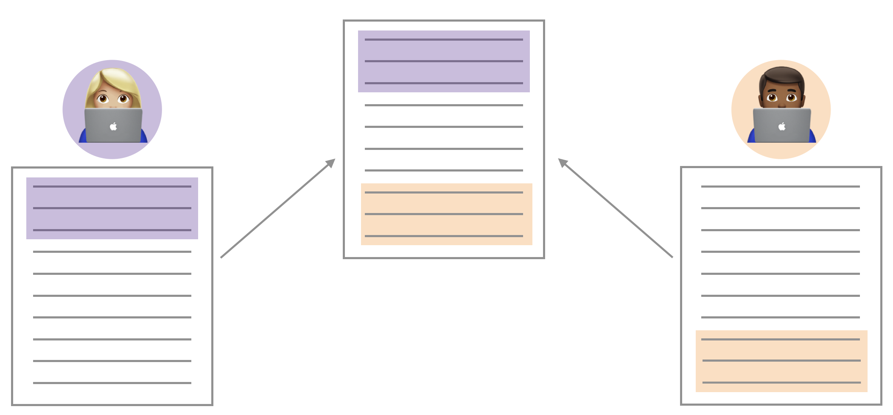

```{r setup, include=FALSE}
knitr::opts_chunk$set(eval = FALSE)
```


# Introduction 

The goal of today's lab is fit and interpret multiple linear regression models. Before we get to that, however, we will look at something that may happen as you collaborate with your lab team (or any other team!) in GitHub.

# Merge Conflicts (uh oh)


```{r fig.margin=TRUE, eval=TRUE, echo=FALSE}

```

You may have seen this already through the course of your collaboration in Lab 03. When two collaborators make changes to a file and push the file 
to their repository, git merges these two files.

```{r fig.margin=TRUE, eval = TRUE, echo=FALSE}
knitr::include_graphics("img/04-candy/merge-conflict.png")
```


If these two files have conflicting content on the same line, git will produce a
**merge conflict**. Merge conflicts need to be resolved manually, as they require a human 
intervention:

```{r fig.margin=FALSE, eval=TRUE, echo=FALSE}
knitr::include_graphics("img/04-candy/merge-conflict-identifiers.png")
```

To resolve the merge conflict, decide if you want to keep only your text, the 
text on GitHub, or incorporate changes from both texts. Delete the conflict 
markers `<<<<<<<`, `=======`, `>>>>>>>` and make the changes you want in the 
final merge.

**Assign numbers 1, 2, 3, and 4 to each of your team members** (if only 3 team 
members, just number 1 through 3). Go through the following steps in detail, 
which simulate a merge conflict. Completing this exercise will be part of the 
lab grade.

## Resolving a merge conflict

**Step 1: Everyone** clone the **lab-04-candy** assignment repo in RStudio and open file **merge-conflict.Rmd**. Don't forget to configure git if you haven't already done so:

```{r eval = FALSE}
library(usethis)
use_git_config(user.name="your github username", user.email="your email")
```

**Member 4** should look at the group’s repo on GitHub.com to ensure that the other 
members’ files are pushed to GitHub after every step.

**Step 2: Member 1** Change the team name to your team name. *Knit, commit, and push*.

**Step 3: Member 2** Change the team name to something different (i.e., not your
team name). *Knit, commit, and push*. 

You should get an error.

**Pull** and review the document with the merge conflict. Read the error to your teammates. You can also show them the error by sharing your screen. A merge conflict occurred because you edited the same part of the 
document as Member 1. Resolve the conflict with whichever name you want to keep,
then knit, commit and push again.

**Step 4: Member 3** Write some narrative in the space provided. You should get an error.

This time, no merge conflicts should occur, since you edited a different part of
the document from Members 1 and 2. Read the error to your teammates. You can also show them the error by sharing your screen. 

Click to pull.  *Then, knit, commit, and push.*

## The data 

The data from this lab comes from the the article FiveThirtyEight [*The Ultimate Halloween Candy Power Ranking*](https://fivethirtyeight.com/features/the-ultimate-halloween-candy-power-ranking) by Walt Hickey. To collect data, Hickey and collaborators at FiveThirtyEight set up an experiment people could vote on a series of randomly generated candy matchups (e.g. Reeses vs. Skittles). Click [here](http://walthickey.com/2017/10/18/whats-the-best-halloween-candy/) to check out some of the matchups.

The goal of this analysis is to fit a linear regression model to help determine what makes the best candy. The data set contains the characteristics and win percentage from 85 candies in the experiment. The data set includes the following variables: 

Variable | Description
-------|------------
`chocolate` | Does it contain chocolate?
`fruity` | Is it fruit flavored?
`caramel` | Is there caramel in the candy?
`peanutalmondy` | Does it contain peanuts, peanut butter or almonds?
`nougat` | Does it contain nougat?
`crispedricewafer` | Does it contain crisped rice, wafers, or a cookie component?
`hard` | Is it a hard candy?
`bar` | Is it a candy bar?
`pluribus` | Is it one of many candies in a bag or box?
`sugarpercent` | The percentile of sugar it falls under within the data set.
`pricepercent` | The unit price percentile compared to the rest of the set.
`winpercent` | The overall win percentage according to 269,000 matchups.

Use the code below to load the data directly from the [FiveThirtyEight's github repo](https://github.com/fivethirtyeight/data/tree/master/candy-power-ranking).

```{r}
candy <- read_csv("https://raw.githubusercontent.com/fivethirtyeight/data/master/candy-power-ranking/candy-data.csv")
```

## Exercises 

1. You hypothesize that the amount of sugar and whether the candy is chocolate will be important predictors of the candy's win percentage, so you want to start with a model that includes these two variables. Create plots to visualize the relationship between each predictor and the response variable. Arrange the plots side-by-side using functions from [`patchwork`](https://patchwork.data-imaginist.com/) or a similar package.

*Hint: Make `chocolate` a factor, so R correctly treats it as a categorical variable.*

1. Describe the relationship between the response and each predictor variable based on the plots from the previous exercise. 

1. Fit a model using `sugarpercent` and `chocolate` to predict `winpercent`.

1. Using the model from the previous exercise 
  - Interpret the coefficient of `sugarpercent` in the context of the data. 
  - What is the intercept in the model for candy that is **<u>not**</u> chocolate? 
  - What is the intercept in the model for candy that **is** chocolate?

1. Let's see if there's a potential interaction between the sugar percentile and chocolate. Plot the relationship between `winpercent` and `sugarpercent` based on the `chocolate`, including lines to summarize the relationship between the variables. 

  Based on this plot, do you think there's an interaction effect between `sugarpercent` and `chocolate`? Briefly explain why or why not.

1. Fit the model including `sugarpercent`, `chocolate`, and their interaction. Display the code and model output. 

1. Using the model above, 
  - Describe the type of candy that is expected to not win any matchups. 
  - What does the coefficient for the interaction between `suagrpercent` and `winpercent` mean?
  - Describe the effect of `sugarpercent` on `winpercent` for candy that is not chocolate. 

1. Does the data provide sufficient evidence that the effect of `sugarpercent` on `winpercent` differs based on whether the candy is chocolate? Briefly explain why or why not. 

1. Select a variable of your choice. (*If you choose a categorical variable, be sure to convert it to a factor variable first.*) What variable did you choose?
  - Plot the relationship between `winpercent` and your new variable.
  - Fit a regression model using `suarpercent`, `chocolate`, your variable, and an interaction between the variable and either `sugarpercet` or `chocolate`.
  - Interpret the main effect term for the variable you chose. 
  - Interpret the main effect term for the variable you chose

1. Based on the model from the previous exercise, how might you describe the "best" candy  - the candy that wins as much as possible. 


## Submission 

Upload the team's PDF to Gradescope. Be sure to include every team member's name in the Gradescope submission Associate the "Overall" graded section with the first page of your PDF, and mark where each answer is  to the exercises. If any answer spans multiple pages, then mark all pages.

There should only be **<u>one</u>** submission per team on Gradescope. **Be sure to include every team member's name in the Gradescope submission.**


