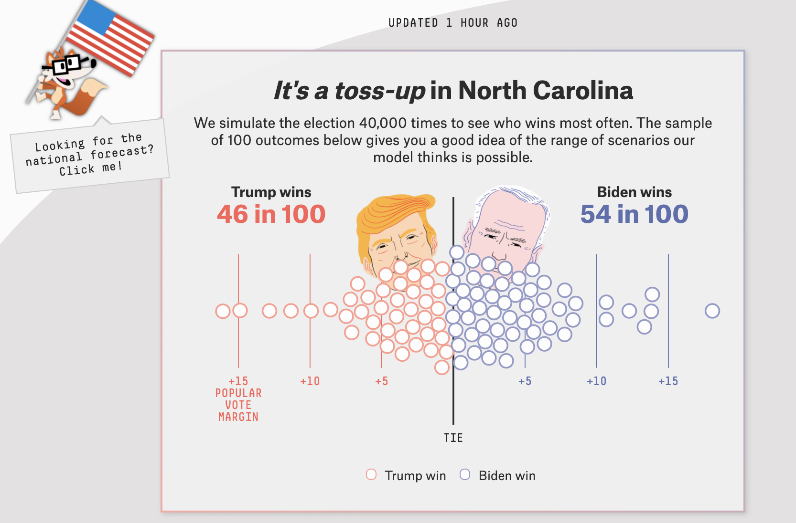

```{r child = "setup.Rmd"}
```

```{r}
library(tidyverse)
library(knitr)
library(broom)
```

class: middle, center

## [Click here for PDF of slides](15-logistic-odds.pdf)

---

## Topics

- Logistic regression for binary response variable

- Relationship between odds and probabilities

- Use logistic regression model to calculate predicted odds and probabilities

---

## Types of response variables

.vocab[Quantitative response variable]: 
- Sales price of a house in Levittown, NY
- **Model**: Expected sales price given the number of bedrooms, lot size, etc.

--

.vocab[Categorical response variable]: 
- High risk of coronary heart disease
- **Model**: Probability an adult is high risk of heart disease given their age, total cholesterol, etc. 

---

## Models for categorical response variables

.pull-left[
.vocab[Logistic Regression]

2 Outcomes

1: Yes, 0: No
]

--

.pull-right[
.vocab[Multinomial Logistic Regression]

3+ Outcomes 

1: Democrat, 2: Republican, 3: Independent
]

<br><br>

--

.center[
**Let's focus on logistic regression models for now.**
]

---

## FiveThirtyEight 2020 election forcasts

```{r echo = F, fig.align = "center", out.width = '70%'}

```

.footnote[[FiveThirtyEight Election Forcasts](https://projects.fivethirtyeight.com/2020-election-forecast/)]

---
## FiveThirtyEight NBA finals predictions

```{r echo = F, fig.align = "center", out.width = '40%'}
include_graphics("img/15/nba-predictions.png")
```

.footnote[[2019-20 NBA Predictions](https://projects.fivethirtyeight.com/2020-nba-predictions/games/?ex_cid=rrpromo)]

---

## Do teenagers get 7+ hours of sleep?

.pull-left[
Students in grades 9 - 12 surveyed about health risk behaviors including whether they usually get 7 or more hours of sleep. 

.vocab[`Sleep7`]

1: yes

0: no
]

.pull-right[
```{r}
library(Stat2Data)
data(YouthRisk2009)
sleep <- YouthRisk2009 %>%
  filter(!is.na(Age), !is.na(Sleep7))
sleep %>%
  select(Age, Sleep7) %>%
  slice(1:10) %>%
  kable()
```
]

---

## Let's fit a linear regression model

.vocab[Response]: $Y$ = 1: yes, 0: no

```{r}
ggplot(data = sleep, aes(x = Age, y = Sleep7)) +
  geom_point() + 
  geom_smooth(method = "lm", se = FALSE) +
  labs(y = "Getting 7+ hours of sleep")  + 
  theme_bw() 
```

---

## Let's use proportions 

.vocab[Response]: Probability of getting 7+ hours of sleep

```{r}
sleep_age <- sleep %>%
  group_by(Age) %>%
  summarise(prop = mean(Sleep7))

ggplot(data = sleep_age, aes(x = Age, y = prop)) +
  geom_point() + 
  geom_hline(yintercept = c(0,1), lty = 2) + 
  stat_smooth(method = "lm",fullrange = TRUE, se = FALSE) +
  labs(y = "P(7+ hours of sleep)") +
  theme_bw()
```

---

## What happens if we zoom out? 

.vocab[Response]: Probability of getting 7+ hours of sleep

```{r}
sleep_age <- sleep %>%
  group_by(Age) %>%
  summarise(prop = mean(Sleep7))

ggplot(data = sleep_age, aes(x = Age, y = prop)) +
  geom_point() + 
  geom_hline(yintercept = c(0,1), lty = 2) + 
  xlim(1, 40) +
  ylim(-1,2) +
  labs(y = "P(7+ hours of sleep)") +
  stat_smooth(method = "lm",fullrange = TRUE, se = FALSE) +
  theme_bw()
```

`r emo::ji("stop_sign")` **This model produces predictions outside of 0 and 1.**

---

## Let's try another model 

```{r}
sleep_age <- sleep %>%
  group_by(Age) %>%
  summarise(prop = mean(Sleep7))

ggplot(data = sleep_age, aes(x = Age, y = prop)) +
  geom_point() + 
  geom_hline(yintercept = c(0,1), lty = 2) + 
  xlim(1, 40) +
  ylim(-0.5, 1.5) +
  labs(y = "P(7+ hours of sleep)") +
  stat_smooth(method ="glm", method.args = list(family = "binomial"), fullrange = TRUE, se = FALSE) +
  theme_bw()
```

`r emo::ji("white_check_mark")` This model (called a .vocab[logistic regression model]) only produces predictions between 0 and 1. 

---

## Different types of models

| Method                        | Response Type | Model |   
|-------------------------------|---------------|-------|
| Linear Regression             | Quantitative       | $Y = \beta_0 + \beta_1~ X$ |   
| Linear regression (transform Y) | Quantitative       | $\log(Y) = \beta_0 + \beta_1~ X$ |   
| Logistic regression           | Binary        | $\log\big(\frac{\pi}{1-\pi}\big) = \beta_0  + \beta_1 ~ X$ |  

---

## Binary response variable 

- $Y = 1: \text{ yes}, 0: \text{ no}$

--

- $\pi$: .vocab[probability] that $Y=1$, i.e., $P(Y = 1)$

--

- $\frac{\pi}{1-\pi}$: .vocab[odds] that $Y = 1$

--

- $\log\big(\frac{\pi}{1-\pi}\big)$: .vocab[log odds] 

--

- Go from $\pi$ to $\log\big(\frac{\pi}{1-\pi}\big)$ using the .vocab[logit transformation]

---

## Odds

Suppose there is a **70% chance** it will rain tomorrow

--

- Probability it will rain is $\mathbf{p = 0.7}$

--

- Probability it won't rain is $\mathbf{1 - p = 0.3}$

--

- Odds it will rain are **7 to 3**, **7:3**, $\mathbf{\frac{0.7}{0.3} \approx 2.33}$ 

---

## Are teenagers getting enough sleep? 

.center[
```{r}
sleep %>%
  group_by(Sleep7) %>%
  summarise(n = n()) %>%
  mutate(p = round(n / sum(n), 3))
```
]

--

$P(\text{7+ hours of sleep}) = P(Y = 1) = p = 0.664$ 

--

$P(\text{< 7 hours of sleep}) = P(Y = 0) = 1 - p = 0.336$

--

$P(\text{odds of 7+ hours of sleep}) = \frac{0.664}{0.336} = 1.976$

---

## From odds to probabilities

.vocab[odds] 

$$\omega = \frac{\pi}{1-\pi}$$

--

.vocab[probability]

$$\pi = \frac{\omega}{1 + \omega}$$

---

## Logistic model: from odds to probabilities

`r emo::ji("one")` **Logistic model**: log odds = $\log\big(\frac{\pi}{1-\pi}\big) = \beta_0 + \beta_1~X$


--


`r emo::ji("two")` **odds =** $\exp\big\{\log\big(\frac{\pi}{1-\pi}\big)\big\} = \frac{\pi}{1-\pi}$


--


Combining `r emo::ji("one")` and `r emo::ji("two")` with what we saw earlier

$$\text{probability} = \pi = \frac{\exp\{\beta_0 + \beta_1~X\}}{1 + \exp\{\beta_0 + \beta_1~X\}}$$

---

## Logistic regression model

.eq[
**Logit form**: 
$$\log\big(\frac{\pi}{1-\pi}\big) = \beta_0 + \beta_1~X$$
]

--

.eq[
**Probability form**:

$$\pi = \frac{\exp\{\beta_0 + \beta_1~X\}}{1 + \exp\{\beta_0 + \beta_1~X\}}$$
]

---

## Risk of coronary heart disease 

This dataset is from an ongoing cardiovascular study on residents of the town of Framingham, Massachusetts. We want to use .vocab[`age`] to predict if a randomly selected adult is high risk of having coronary heart disease in the next 10 years. 

.vocab[`high_risk`]: 

- 1: High risk of having heart disease in next 10 years
- 0: Not high risk of having heart disease in next 10 years

.vocab[`age`]: Age at exam time (in years)

```{r echo = F}
heart_data <- read_csv("https://raw.githubusercontent.com/sta210-sp20/datasets/master/framingham.csv") %>%
  select(age, TenYearCHD) %>%
  drop_na() %>%
  mutate(high_risk = as.factor(TenYearCHD))
```

---

## High risk vs. age

```{r}
ggplot(data = heart_data, aes(x = high_risk, y = age)) +
  geom_boxplot() +
  labs(x = "High risk - 1: yes, 0: no",
       y = "Age", 
       title = "Age vs. High risk of heart disease") +
  theme_bw()
```

---

## Let's fit the model 

```{r echo = T}
high_risk_model <- glm(high_risk ~ age, #<<
                       data = heart_data,
                       family = "binomial") #<<
tidy(high_risk_model) %>% 
  kable(digits = 3)
```

---

## Let's fit the model 

```{r}
tidy(high_risk_model) %>% 
  kable(digits = 3)
```

<br> 

.eq[
$$\log\Big(\frac{\hat{\pi}}{1-\hat{\pi}}\Big) = -5.561 + 0.075 \times \text{age}$$
where $\hat{\pi}$ is the predicted probability of being high risk 
]

---

## Predicted log odds 

```{r echo = T, eval = F}
predict(high_risk_model)
```

```{r}
round(predict(high_risk_model)[1:10],3) 
```

--

**For observation 1**

$$\text{predicted odds} = \hat{\omega} = \frac{\hat{\pi}}{1-\hat{\pi}} = \exp\{-2.650\} = 0.071$$

---

## Predcited probabilities 

```{r eval = F, echo = T}
predict(high_risk_model, 
        type = "response") #<<
```

```{r}
round(predict(high_risk_model, type = "response")[1:10],3)
```

--

$$\text{predicted probabilities} = \hat{\pi} = \frac{\exp\{-2.650\}}{1 + \exp\{-2.650\}} = 0.066$$
---

## Recap

- Logistic regression for binary response variable

- Relationship between odds and probabilities

- Used logistic regression model to calculate predicted odds and probabilities


