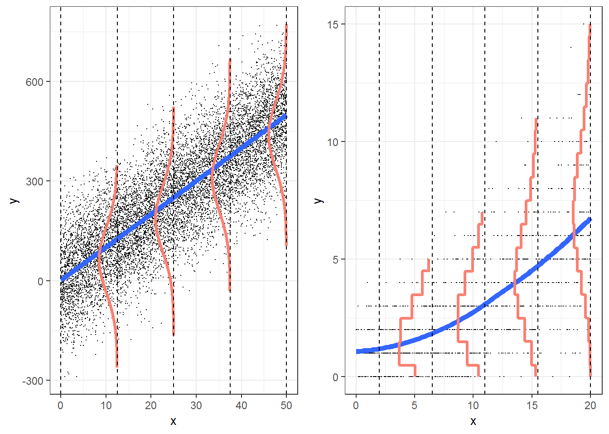

```{r setup, include=FALSE, echo=FALSE}
options(htmltools.dir.version = FALSE)
knitr::opts_chunk$set(
	fig.align = "center",
	fig.height =5,
	fig.width = 8,
	message = FALSE,
	warning = FALSE,
	echo = FALSE
)
```

class: middle, center

## [Click for PDF of slides](23-poisson.pdf)

```{r,echo=F}
library(tidyverse)
library(knitr)
library(broom)
library(pROC) 
library(kableExtra)
library(patchwork)
```

---

## Poisson response variables

The following are examples of scenarios with Poisson response variables:  

- Are the .vocab[number of motorcycle deaths] in a given year related to a state’s helmet laws?

- Does the .vocab[number of employers] conducting on-campus interviews during a year differ for public and private colleges?

- Does the .vocab[daily number of asthma-related visits] to an Emergency Room differ depending on air pollution indices?

- Has the .vocab[number of deformed fish] in randomly selected Minnesota lakes been affected by changes in trace minerals in the water over the last decade?

---

## Poisson Distribution 

If $Y$ follows a Poisson distribution, then 

$$P(Y=y) = \frac{\exp\{-\lambda\}\lambda^y}{y!} \hspace{10mm} y=0,1,2,\ldots$$

--

**Features of the Poisson distribution**
- Mean and variance are equal $(\lambda)$
- Distribution tends to be skewed right, especially when the mean is small
- If the mean is larger, it can be approximated by a Normal distribution


---

## Simulated Poisson distributions

```{r echo = F, fig.height = 5}
set.seed(20)
sim1 <- rpois(100000,2)
sim2 <- rpois(100000,5)
sim3 <- rpois(100000,20)
sim4 <- rpois(100000,100)
pois_sim <- tibble (
  sim1 = sim1, 
  sim2 = sim2, 
  sim3 = sim3, 
  sim4 = sim4
)


p1 <- ggplot(data = pois_sim, aes(x = sim1)) +
  geom_histogram() +
  labs(x = "", title = "lambda = 2")

p2 <- ggplot(data = pois_sim, aes(x = sim2)) +
  geom_histogram() +
  labs(x = "", title = "lambda = 5")

p3 <- ggplot(data = pois_sim, aes(x = sim3)) +
  geom_histogram() +
  labs(x = "", title = "lambda = 20")

p4 <- ggplot(data = pois_sim, aes(x = sim4)) +
  geom_histogram() +
  labs(x = "", title = "lambda = 100")

(p1 + p2) / (p3  + p4)
```

---

## Simulated Poisson distributions

```{r echo = F}
sum1 <- c(mean(sim1), var(sim1))
sum2 <- c(mean(sim2), var(sim2))
sum3 <- c(mean(sim3), var(sim3))
sum4 <- c(mean(sim4), var(sim4))
data <- rbind(sum1,sum2,sum3,sum4)
rownames(data) <- c("lambda=2", "lambda=5","lambda=20", "lambda=100")
colnames(data) <- c("Mean", "Variance")
kable(data,format="html")
```

---

## Poisson Regression

- We want $\lambda$ to be a function of predictor variables $x_1, \ldots, x_p$

--

.question[
Why is a multiple linear regression model not appropriate?
]

--

- $\lambda$ must be greater than or equal to 0 for any combination of predictor variables
- Constant variance assumption will be violated!

---

## Multiple linear regression vs. Poisson 

```{r echo = F, out.width = "65%"}

```


.footnote[Image from: [*Broadening Your Statistical Horizons*](https://bookdown.org/roback/bookdown-bysh/ch-poissonreg.html)]

---

## Poisson Regression

If the observed values $Y_i$ are Poisson, then we can model using a <font class="vocab">Poisson regression model</font> of the form

.alert[
$$\log(\lambda_i) = \beta_0 + \beta_1 x_{1i} + \beta_2 x_{2i} + \dots + \beta_p x_{pi}$$
]
---
 
## Interpreting Model Coefficients

- <font class="vocab">Slope, $\beta_j$: </font>
    - **Quantitative Predictor**:  When $x_j$ increases by one unit, the mean of $y$ is expected to multiply by a factor of $\exp\{\beta_j\}$, (*holding all else constant*).
    
    - **Categorical Predictor**: The mean of $y$ for category $k$ is expected to be $\exp\{\beta_j\}$ times the mean of $y$  for the baseline category, (*holding all else constant*).

--

- <font class="vocab">Intercept, $\beta_0$: </font> When all of the predictors equal 0, the mean of $y$ is expected to be $\exp\{\beta_0\}$.

---

## Example: Household size in the Philippines

The data come from the 2015 Family Income and Expenditure Survey conducted by the Philippine Statistics Authority. 

.vocab[Goal:] We want to use the data to understand the relationship between the age of the head of the household and the number of people in their household. 

.vocab[Variables]

- `age`: the age of the head of household
- `total`: the number of people in the household other than the head

```{r echo = F}
hh <- read_csv("data/fHH1.csv") %>%
  filter(age < 95) %>%
  mutate(ageCent = age - mean(age))
```


---

## Exploratory data analysis 

```{r}
ggplot(data = hh, aes(x = total)) + 
  geom_histogram() + 
  labs(title = "Number of people in the household", 
       y = "count",
       x = "") + 
  theme_bw()
```

---

## Exploratory data analysis 

Let's examine a plot of the log-transformed mean number of people in the household by age

```{r}
hh %>%
  group_by(age) %>%
  summarise(log_mean_total = log(mean(total))) %>%
  ggplot(aes(x = age, y = log_mean_total)) +
  geom_point() +
  labs(y = "Log(mean household number)", 
       x = "Age", 
       title = "Log-transformed mean household number vs. age") +
  theme_bw()
```


---

## Exploratory data analysis 

Let's examine a plot of the log-transformed mean number of people in the household by age

```{r}
hh %>%
  group_by(age) %>%
  summarise(log_mean_total = log(mean(total))) %>%
  ggplot(aes(x = age, y = log_mean_total)) +
  geom_point() +
  geom_smooth(se = FALSE) +
    labs(y = "Log(mean household number)", 
       x = "Age", 
       title = "Log-transformed mean household number vs. age") +
  theme_bw()
```

---

## Number in household vs. age
.midi[
```{r echo = T}
model1 <- glm(total ~ ageCent, data = hh, family = "poisson")
tidy(model1, conf.int = T) %>%
  kable(digits = 3)
```
]

$$\color{#87037B}{\log(\overline{\text{total}}) = 1.303 - 0.0047 \times \text{ageCent}}$$

---

## Interpretations

```{r echo = F}
tidy(model1, conf.int = T) %>%
  kable(digits = 3)
```

--

For each additional year older the head of the household is, we expect the mean number in the house to multiply by a factor of `r round(exp(-0.0047),3)` (exp(-0.0047)). 

--

For households with a head of the household who is `r round(mean(hh$age),3)` years old, we expect the mean number of people in the household to be `r round(exp(1.303),3)` (exp(1.303)).


---

## Drop-In-Deviance Test

We can use a .vocab[drop-in-deviance test] to compare nested models (similar to logistic regression). 

Let's try adding `ageCent^2` to the model. 

$$H_0: \beta_{ageCent^2} = 0 \text{ vs. }H_a: \beta_{ageCent^2} \neq 0$$

.midi[
```{r echo=T}
model1 <- glm(total ~ ageCent, data = hh, family = "poisson")
model2 <- glm(total ~ ageCent + I(ageCent^2),
              data = hh, family = "poisson")
```

```{r echo = T, eval = F}
anova(model1, model2, test = "Chisq")
```
]
---

## Drop-In-Deviance Test

```{r}
anova(model1, model2, test = "Chisq") %>%
  kable(digits = 3)
```

--

The p-value is small, so we reject $H_0$. We will include `ageCent^2` to the model. 


---

## Final model 

```{r}
tidy(model2, conf.int = T) %>%
  kable(digits = 3)
```

---

## Model Assumptions 

1. .vocab[Poisson Response]: The response follows a Poisson distribution for each level of the predictor.

2. .vocab[Independence]: The observations are independent of one another.

3. .vocab[Mean = variance]: The mean value of the response equals the variance of the response for each level of the predictor.

4. .vocab[Linearity]: $\log(\lambda)$ is a linear function of the predictors.

---

## Poisson response 

Let's check the first assumption by looking at the distribution of the response for groups of the predictor.


```{r echo = T}
hh <- hh %>%
  mutate(age_group = cut(age, breaks = seq(15, 100, 5)))
```

---

## Poisson response 

.small[
```{r echo = F}
ggplot(data = hh, aes(x = total)) +
  geom_histogram() +
  facet_wrap(~ age_group)
```
]

This condition is satisfied based on the overall distribution of the response (from the EDA) and the distribution of the response by age group.

---

## Independence

We don't have much information about how the households were selected for the survey. 

If the households were not selected randomly but rather groups of household were selected from different areas with different customs about living arrangements, then the independence assumption would be violated. 

---

## Mean = variance

Let's look at the mean and variance for each age group. 

```{r}
hh %>%
  group_by(age_group) %>%
  summarize(mean_total = mean(total), var_total = var(total), n = n()) %>%
  slice(1:10)
```

---

## Mean = variance


```{r}
hh %>%
  group_by(age_group) %>%
  summarize(mean_total = mean(total), var_total = var(total), n = n()) %>%
  slice(11:16)
```

--

It appears the assumption is violated in some age groups; however, the violations are small enough that we can proceed.


---

## Linearity 

The raw residual for the $i^{th}$ observation, $y_i - \hat{\lambda}_i$, is difficult to interpret since the variance is equal to the mean in the Poisson distribution.

--


Instead, we can analyze a standardized residual called the .vocab[Pearson residual].
$$r_i = \frac{y_i - \hat{\lambda}_i}{\sqrt{\hat{\lambda}_i}}$$

--

We will examine a plot of the Pearson residuals versus the predicted values to check the linearity assumption.

---

## `augment` function

```{r echo = T}
hh_aug <- augment(model2, type.predict = "response", 
                  type.residuals = "pearson")
```


---

## Linearity condition
```{r}
ggplot(hh_aug, aes(x = .fitted, y = .resid)) +
  geom_point(alpha= 0.3) +
  geom_hline(yintercept = 0, color = "red") +
  labs(x = "Predicted mean number of people in household", 
       y = "Pearson residual", 
       title = "Residuals vs. Predicted") +
  theme_bw()
```

--

There is no distinguishable pattern in the residuals, so the linearity assumption is satisfied.

---

## References

These slides draw material from Chapter 4 of  [*Beyond Multiple Linear Regression*](https://bookdown.org/roback/bookdown-bysh/ch-poissonreg.html).